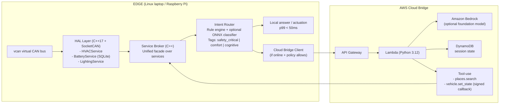

# CabinOS

CabinOS is a hybrid **edge + cloud** vehicle assistant runtime demo: a C++ edge stack handles low-latency cabin controls and safety-ish paths, while a small AWS serverless bridge handles “cognitive” requests over HTTP with session persistence.

---

## Why This Exists

In-vehicle assistants must satisfy three constraints at the same time:

- **Low latency** for control paths (tens of milliseconds)
- **Offline reliability** in tunnels and poor-network areas
- **High cognitive capability** for planning/search-style tasks

CabinOS uses an **edge-first hybrid runtime**:

- Safety-critical and comfort commands are handled on-device
- Cognitive commands route to cloud when online
- Behavior degrades gracefully when cloud is unavailable

---

## High-Level Architecture



---

## Routing Tiers (Mixed Criticality Policy)

| Tier | Example Intents | Execution Path | Target Latency |
|---|---|---|---|
| `safety_critical` | "turn hazards on", "defog rear window" | Edge only (never cloud) | `< 20ms p99` |
| `comfort` | "set cabin to 22C", "dim lights" | Edge first, optional cloud augmentation | `< 50ms p99` |
| `cognitive` | "find coffee on my route" | Cloud-first with offline fallback | `< 2s p95` online |

Core principle:

> **Cloud can propose. Edge validates and actuates.**

---

## Tech Stack

### Edge Runtime

- **C++17**
- **SocketCAN + vcan**
- **gRPC + Protocol Buffers**
- **SQLite** (preferences/state snapshot)
- **spdlog** (structured logs)
- **GTest/GMock**
- **CMake**
- **ONNX Runtime (optional, CPU-only)** for intent classification
- **python-can** simulator for synthetic vehicle frames

### AWS Bridge

- **API Gateway**
- **Lambda (Python 3.12)**
- **Amazon Bedrock (optional)** for foundation-model inference (model is selected via `BEDROCK_MODEL_ID`)
- **DynamoDB**
- **AWS SAM** (recommended for speed) or Terraform

### Tooling

- **Docker + docker-compose**
- **GitHub Actions** (build + tests)
- **k6 or custom C++ harness** for latency benchmarks

---

## Repository Layout (Planned)

```text
CabinOS/
  edge/
    CMakeLists.txt
    proto/
      vehicle.proto
      broker.proto
    hal/
      hvac_service/
      battery_service/
      lighting_service/
    broker/
    router/
    simulator/
      can_publisher.py
    tests/
  cloud/
    template.yaml               # SAM template
    lambda/
      handler.py
  docs/
    design.md
    failure_modes.md
    benchmark_results.md
  docker-compose.yml
  README.md
```

---

## Quick Start (Target Workflow)

### Prerequisites

- Linux environment (native or container) with `vcan` support
- Docker + Docker Compose
- CMake (>=3.20), GCC/Clang with C++17
- Python 3.10+ (for simulator scripts)
- AWS CLI configured (for cloud deployment)

### 1) Clone and bootstrap

```bash
git clone <your-repo-url>
cd CabinOS
```

### 2) Start local stack

```bash
docker compose up --build
```

Expected behavior:

- `vcan` simulator starts publishing frames
- Edge services start and register with broker
- Router receives text commands and dispatches by tier

### 3) Run tests

```bash
ctest --output-on-failure
```

### 4) Benchmark latency

```bash
./scripts/run_benchmarks.sh
```

### 5) Enable real gRPC transport (Bit 4)

By default, CabinOS builds with an in-process RPC adapter for fast iteration. To build the real gRPC transport path:

```bash
cmake -S . -B build -DCABINOS_ENABLE_GRPC=ON
cmake --build build
```

Run the vehicle gRPC server:

```bash
./build/edge/cabinos_grpc_server 0.0.0.0:50051
```

This compiles protobuf/gRPC sources from `edge/proto/services.proto` and exposes the HVAC, Lighting, and Battery services over gRPC.

Call services from terminal using the gRPC client:

```bash
./build/edge/cabinos_grpc_client 127.0.0.1:50051 hazards on
./build/edge/cabinos_grpc_client 127.0.0.1:50051 temp 23
./build/edge/cabinos_grpc_client 127.0.0.1:50051 lights 10
./build/edge/cabinos_grpc_client 127.0.0.1:50051 battery
```

### 6) Simulate CAN battery frames (Bit 5)

Install Python simulator dependency:

```bash
python3 -m pip install -r scripts/requirements.txt
```

On Linux, bring up `vcan0` and start simulator:

```bash
sudo modprobe vcan
sudo ip link add dev vcan0 type vcan
sudo ip link set up vcan0
python3 scripts/can_simulator.py --channel vcan0
```

In another terminal, ingest one frame into `BatteryService`:

```bash
./build/edge/cabinos_can_ingest socketcan vcan0
```

Portable demo without SocketCAN:

```bash
./build/edge/cabinos_can_ingest synthetic 67
```

### 7) Persist runtime state with SQLite (Bit 6)

When SQLite is available, `cabinos_cli` automatically restores and saves:

- cabin temperature
- cabin lights level
- hazards state
- battery SoC

Persistence file:

- `cabinos_state.db` in repository root

Build with persistence enabled (default):

```bash
cmake -S . -B build -DCABINOS_ENABLE_SQLITE=ON
cmake --build build
```

Run CLI and set values:

```bash
./build/edge/cabinos_cli
```

Restart CLI: you should see a state restore message and previous values retained.

### 8) Cloud bridge (SAM + Lambda + DynamoDB)

This repo includes a minimal AWS SAM template under `cloud/`:

- `POST /invoke` accepts JSON: `{"session_id":"...","utterance":"..."}`
- Persists last session fields to DynamoDB
- Returns JSON containing a string field `reply` (plus optional `tool_calls`)

Local development with SAM CLI:

```bash
cd cloud
sam build
sam local start-api --parameter-overrides SignedCallbackSecret=demo-secret
```

Note on DynamoDB + `sam local`:

- `sam local` runs your Lambda in Docker, but **DynamoDB calls still go to real AWS** using your configured credentials.
- Until you `sam deploy` (so the `SessionsTable` exists), you may see `"ddb_persisted": false` in the JSON response. That is expected: the bridge still returns a valid `"reply"` for edge testing.

In another terminal, point the edge CLI at the local API (SAM default is port 3000):

```bash
export CABINOS_CLOUD_URL="http://127.0.0.1:3000/invoke"
export CABINOS_SESSION_ID="demo-session-1"
./build/edge/cabinos_cli
```

Answer `y` for cloud online, then try a cognitive utterance like `find coffee on my route`.

Optional Amazon Bedrock path (requires AWS credentials + model access in your account):

```bash
# In template.yaml / Lambda environment, set:
# USE_BEDROCK=1
# BEDROCK_MODEL_ID=<Bedrock foundation model id>
#
# Back-compat aliases (also supported by the Lambda handler):
# USE_CLOUD_MODEL=1
# CLOUD_MODEL_ID=<Bedrock foundation model id>
```

Deploy to AWS:

```bash
cd cloud
sam deploy --guided
```

---

## Example End-to-End Flows

### Safety-critical intent

Input: `"turn on hazards"`

1. Router classifies as `safety_critical`
2. Policy enforces edge-only path
3. Broker invokes lighting service immediately
4. Result returned without cloud dependency

### Cognitive intent (online)

Input: `"find coffee on my route"`

1. Router classifies as `cognitive`
2. Edge HTTP client calls `POST /invoke` on the cloud bridge (API Gateway in AWS, or SAM local during development)
3. Lambda persists session metadata to DynamoDB and returns a JSON `reply` (Bedrock-backed when enabled, otherwise a deterministic stub)
4. Edge prints the returned `reply` (tool proposals are returned as structured metadata for later edge validation)

### Cognitive intent (offline)

Input: `"find coffee on my route"` with cloud disabled

1. Cloud health check fails
2. Router enters offline fallback branch
3. Returns graceful message + optional cached suggestion
4. Local services remain fully functional

---

## Security Boundary

Cloud tool-use is constrained by design:

- Cloud never directly actuates vehicle services
- `vehicle.set_state` requests are signed and schema-validated
- Edge broker re-validates intent, criticality, and allowed state transitions
- Rejected proposals are logged with reason codes

This pattern supports agentic behavior while keeping actuation authority on-device.

---

## Failure Modes and Degradation

CabinOS explicitly tests:

- **Cloud unavailable** -> cognitive requests degrade gracefully; edge controls unaffected
- **CAN stream interruption** -> stale-data detection and conservative defaults
- **Service crash** -> broker timeout + retry/circuit-break behavior
- **Misclassified intent** -> policy guardrails prevent unsafe cloud routing

See `docs/failure_modes.md` for full matrix and recovery behavior.

---

## Benchmarks and SLO Targets

Publish measured results in `docs/benchmark_results.md` and mirror the latest table here.

| Path | Metric | Target |
|---|---|---|
| Safety-critical | p99 | `< 20ms` |
| Comfort | p99 | `< 50ms` |
| Cognitive (online) | p95 | `< 2s` |
| Cognitive (offline fallback) | response time | `< 300ms` |

Latest measured run (local machine, `ITER_LOCAL=200`, `ITER_CLOUD=20`):

| Path | Iterations | p50 | p95 | p99 |
|---|---:|---:|---:|---:|
| Safety-critical (local) | 200 | `0.00ms` | `0.00ms` | `0.00ms` |
| Comfort (local) | 200 | `0.05ms` | `0.05ms` | `0.06ms` |
| Cognitive (offline fallback) | 200 | `0.00ms` | `0.00ms` | `0.00ms` |
| Cognitive (online, deployed cloud bridge) | 20 | `289.85ms` | `316.80ms` | `461.98ms` |

Also include cost reporting:

- Token usage per request type (when Bedrock inference is enabled)
- Estimated cost per 1,000 cognitive requests

---

## AWS Deployment (SAM)

From `cloud/`:

```bash
sam build
sam deploy --guided
```

Required environment variables for Lambda:

- `SESSIONS_TABLE_NAME` (set automatically by the SAM template)
- `SIGNED_CALLBACK_SECRET` (template parameter)

Optional environment variables for Lambda:

- `USE_BEDROCK` (`1` enables Bedrock inference; `0` uses the deterministic stub)
- `BEDROCK_MODEL_ID` (Bedrock foundation model identifier)
- `SIGNED_CALLBACK_SECRET` (used to sign cloud tool proposals; must match `CABINOS_PROPOSAL_SECRET` on edge)

Aliases (optional, supported for convenience):

- `USE_CLOUD_MODEL` (same meaning as `USE_BEDROCK`)
- `CLOUD_MODEL_ID` (same meaning as `BEDROCK_MODEL_ID`)

Signed cloud proposal demo commands (through edge CLI while cloud is online):

- `proposal heat 24` (proposes `set_temperature_c`)
- `proposal dim 15` (proposes `set_cabin_lights_percent`)
- `proposal hazards on` (proposes `set_hazards`)

Set edge-side secret before running `cabinos_cli`:

```bash
export CABINOS_PROPOSAL_SECRET="<same value as SIGNED_CALLBACK_SECRET>"
```

Recommended IAM scope:

- Amazon Bedrock invoke permissions for the configured foundation model
- DynamoDB table read/write for session state
- No broad wildcard permissions

---

## Testing Strategy

- **Unit tests**: service logic, policy/routing rules, schema validators
- **Integration tests**: broker <-> services, router <-> broker, cloud bridge contract
- **Failure injection tests**: network drop, process kill, malformed callback payload
- **Performance tests**: sustained command load across mixed intent types

Run the automated failure-injection suite:

```bash
CABINOS_CLOUD_URL="https://<api-id>.execute-api.<region>.amazonaws.com/Prod/invoke" ./scripts/run_failure_suite.sh
```

Manual edge proposal security checks are documented in `scripts/failures/edge_proposal_manual.md`.

Target: **>= 80% coverage** on edge runtime modules.


