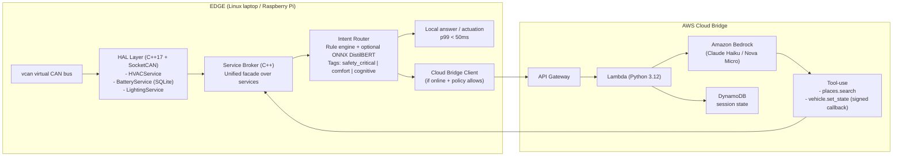

# CabinOS

**An edge-first in-vehicle agent runtime.**

CabinOS is a masters-level systems project that mirrors the architecture pattern behind modern hybrid automotive assistants: latency-critical vehicle controls run locally on the edge, while cognitive tasks can be delegated to AWS Bedrock through a constrained cloud bridge.

The project is designed for one developer to complete in 1-2 months on AWS free tier.

---

## Why This Exists

In-vehicle assistants must satisfy three constraints at the same time:

- **Low latency** for control paths (tens of milliseconds)
- **Offline reliability** in tunnels and poor-network areas
- **High cognitive capability** for planning/search-style tasks

CabinOS uses an **edge-first hybrid runtime**:

- Safety-critical and comfort commands are handled on-device
- Cognitive commands route to cloud when online
- Behavior degrades gracefully when cloud is unavailable

---

## High-Level Architecture



---

## Routing Tiers (Mixed Criticality Policy)

| Tier | Example Intents | Execution Path | Target Latency |
|---|---|---|---|
| `safety_critical` | "turn hazards on", "defog rear window" | Edge only (never cloud) | `< 20ms p99` |
| `comfort` | "set cabin to 22C", "dim lights" | Edge first, optional cloud augmentation | `< 50ms p99` |
| `cognitive` | "find coffee on my route" | Cloud-first with offline fallback | `< 2s p95` online |

Core principle:

> **Cloud can propose. Edge validates and actuates.**

---

## Tech Stack

### Edge Runtime

- **C++17**
- **SocketCAN + vcan**
- **gRPC + Protocol Buffers**
- **SQLite** (preferences/state snapshot)
- **spdlog** (structured logs)
- **GTest/GMock**
- **CMake**
- **ONNX Runtime (optional, CPU-only)** for intent classification
- **python-can** simulator for synthetic vehicle frames

### AWS Bridge

- **API Gateway**
- **Lambda (Python 3.12)**
- **Amazon Bedrock** (tool-use enabled model)
- **DynamoDB**
- **AWS SAM** (recommended for speed) or Terraform

### Tooling

- **Docker + docker-compose**
- **GitHub Actions** (build + tests)
- **k6 or custom C++ harness** for latency benchmarks

---

## Repository Layout (Planned)

```text
CabinOS/
  edge/
    CMakeLists.txt
    proto/
      vehicle.proto
      broker.proto
    hal/
      hvac_service/
      battery_service/
      lighting_service/
    broker/
    router/
    simulator/
      can_publisher.py
    tests/
  cloud/
    template.yaml               # SAM template
    lambda/
      handler.py
      tools/
        places_search.py
        vehicle_set_state.py
    events/
  docs/
    design.md
    failure_modes.md
    benchmark_results.md
  docker-compose.yml
  README.md
```

---

## Quick Start (Target Workflow)

### Prerequisites

- Linux environment (native or container) with `vcan` support
- Docker + Docker Compose
- CMake (>=3.20), GCC/Clang with C++17
- Python 3.10+ (for simulator scripts)
- AWS CLI configured (for cloud deployment)

### 1) Clone and bootstrap

```bash
git clone <your-repo-url>
cd CabinOS
```

### 2) Start local stack

```bash
docker compose up --build
```

Expected behavior:

- `vcan` simulator starts publishing frames
- Edge services start and register with broker
- Router receives text commands and dispatches by tier

### 3) Run tests

```bash
ctest --output-on-failure
```

### 4) Benchmark latency

```bash
./scripts/run_benchmarks.sh
```

---

## Example End-to-End Flows

### Safety-critical intent

Input: `"turn on hazards"`

1. Router classifies as `safety_critical`
2. Policy enforces edge-only path
3. Broker invokes lighting service immediately
4. Result returned without cloud dependency

### Cognitive intent (online)

Input: `"find coffee on my route"`

1. Router classifies as `cognitive`
2. Bridge calls Lambda -> Bedrock
3. Bedrock tool-use executes `places.search`
4. Best result returned to edge session

### Cognitive intent (offline)

Input: `"find coffee on my route"` with cloud disabled

1. Cloud health check fails
2. Router enters offline fallback branch
3. Returns graceful message + optional cached suggestion
4. Local services remain fully functional

---

## Security Boundary

Cloud tool-use is constrained by design:

- Cloud never directly actuates vehicle services
- `vehicle.set_state` requests are signed and schema-validated
- Edge broker re-validates intent, criticality, and allowed state transitions
- Rejected proposals are logged with reason codes

This pattern supports agentic behavior while keeping actuation authority on-device.

---

## Failure Modes and Degradation

CabinOS explicitly tests:

- **Cloud unavailable** -> cognitive requests degrade gracefully; edge controls unaffected
- **CAN stream interruption** -> stale-data detection and conservative defaults
- **Service crash** -> broker timeout + retry/circuit-break behavior
- **Misclassified intent** -> policy guardrails prevent unsafe cloud routing

See `docs/failure_modes.md` for full matrix and recovery behavior.

---

## Benchmarks and SLO Targets

Publish measured results in `docs/benchmark_results.md` and mirror the latest table here.

| Path | Metric | Target |
|---|---|---|
| Safety-critical | p99 | `< 20ms` |
| Comfort | p99 | `< 50ms` |
| Cognitive (online) | p95 | `< 2s` |
| Cognitive (offline fallback) | response time | `< 300ms` |

Also include cost reporting:

- Bedrock token usage per request type
- Estimated cost per 1,000 cognitive requests

---

## AWS Deployment (SAM)

From `cloud/`:

```bash
sam build
sam deploy --guided
```

Required environment variables for Lambda:

- `BEDROCK_MODEL_ID`
- `SESSION_TABLE_NAME`
- `SIGNED_CALLBACK_SECRET`

Recommended IAM scope:

- Bedrock invoke permissions for selected model
- DynamoDB table read/write for session state
- No broad wildcard permissions

---

## Testing Strategy

- **Unit tests**: service logic, policy/routing rules, schema validators
- **Integration tests**: broker <-> services, router <-> broker, cloud bridge contract
- **Failure injection tests**: network drop, process kill, malformed callback payload
- **Performance tests**: sustained command load across mixed intent types

Target: **>= 80% coverage** on edge runtime modules.


